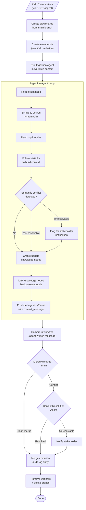
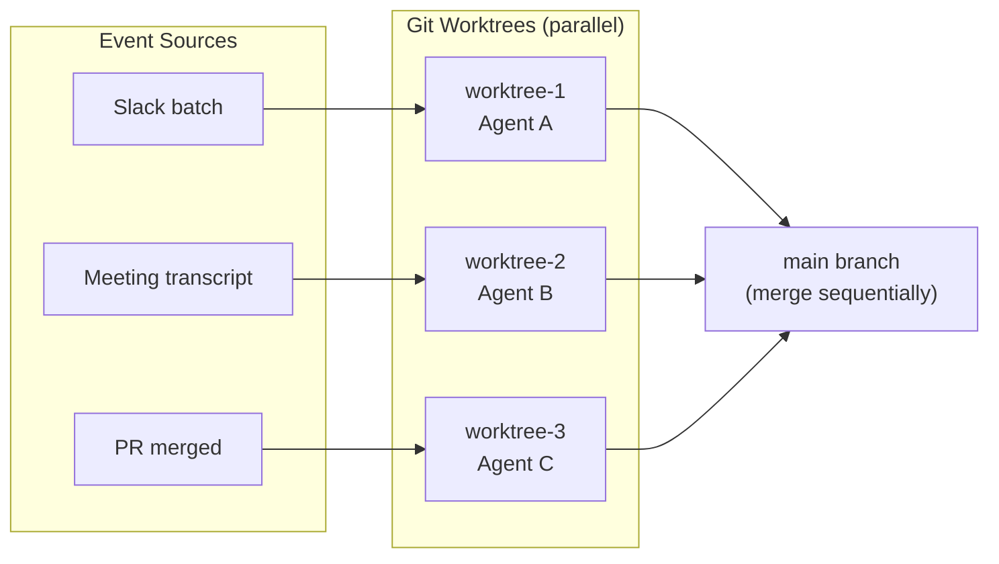
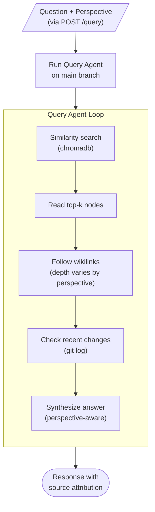
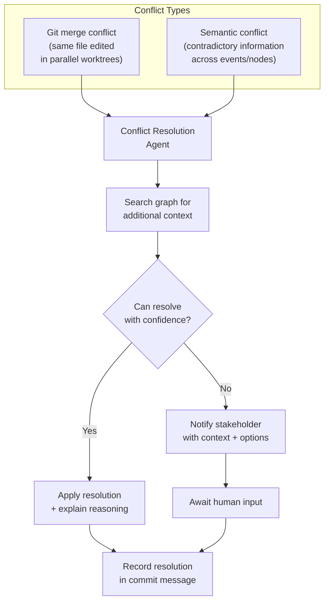

# System Flows

## Ingestion Flow

The primary flow. Event → knowledge graph update.



## Parallel Ingestion

Multiple events processed concurrently. Each gets its own worktree.



## Query Flow

Read-only. No worktree needed — reads from main.



## Conflict Resolution

Handles both git merge conflicts and semantic conflicts.



## Component Architecture

```mermaid
flowchart TB
    subgraph clients ["Clients"]
        API["REST API<br/>(FastAPI)"]
        VIZ["Sigma.js<br/>Visualization"]
    end

    subgraph agents ["Agent Layer"]
        IA["Ingestion<br/>Agent"]
        QA["Query<br/>Agent"]
        OA["Optimize<br/>Agent"]
        CRA["Conflict Resolution<br/>Agent"]
    end

    subgraph tools ["Tool Layer"]
        RT["Read Tools<br/>similarity_search, read_node<br/>list_links, search_nodes<br/>get_recent_changes"]
        WT["Write Tools<br/>create_node<br/>update_node"]
    end

    subgraph infra ["Infrastructure"]
        GRAPH["graph.py<br/>Markdown R/W<br/>Wikilink parsing"]
        EMBED["embeddings.py<br/>Chromadb"]
        GIT["git_ops.py<br/>Worktrees, commits<br/>merge, log"]
        CTX["context.py<br/>GraphContext"]
    end

    subgraph storage ["Storage"]
        MD["graph/nodes/<br/>Markdown files"]
        CHROMA["graph/_index/<br/>Chromadb"]
        GITREPO[".git/<br/>Version history"]
    end

    API --> IA & QA
    VIZ --> API
    IA & QA & OA & CRA --> RT & WT
    RT & WT --> GRAPH & EMBED & GIT
    GRAPH & EMBED & GIT --> CTX
    GRAPH --> MD
    EMBED --> CHROMA
    GIT --> GITREPO
