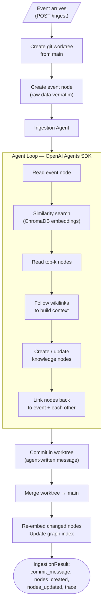
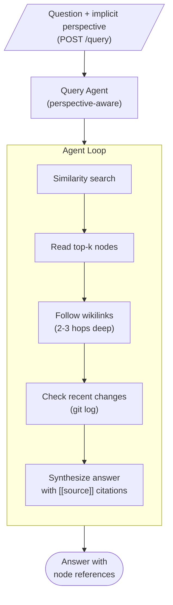
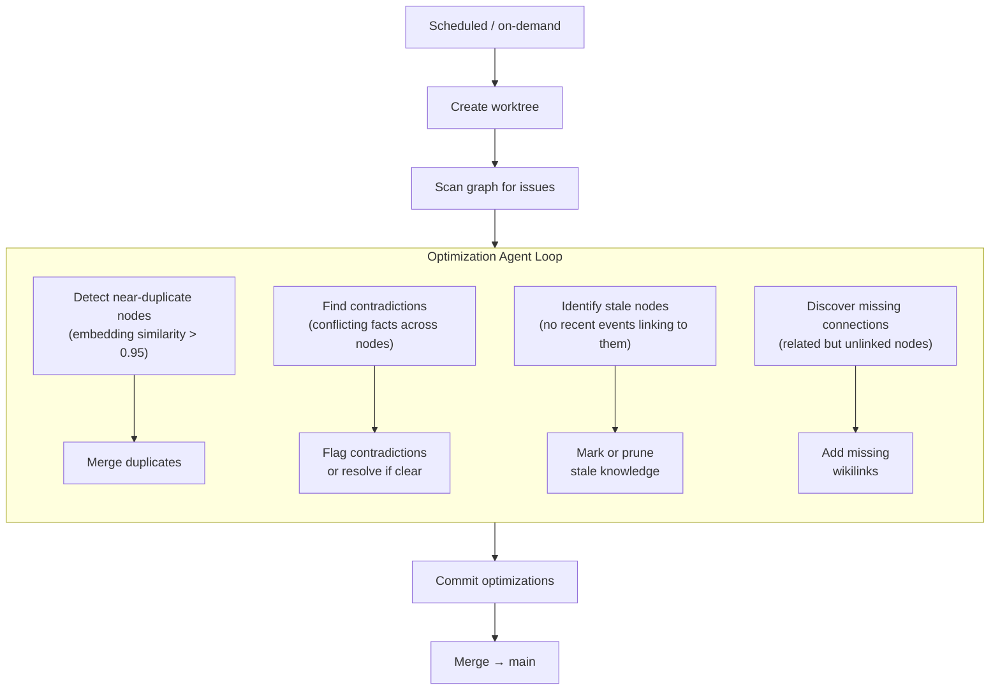
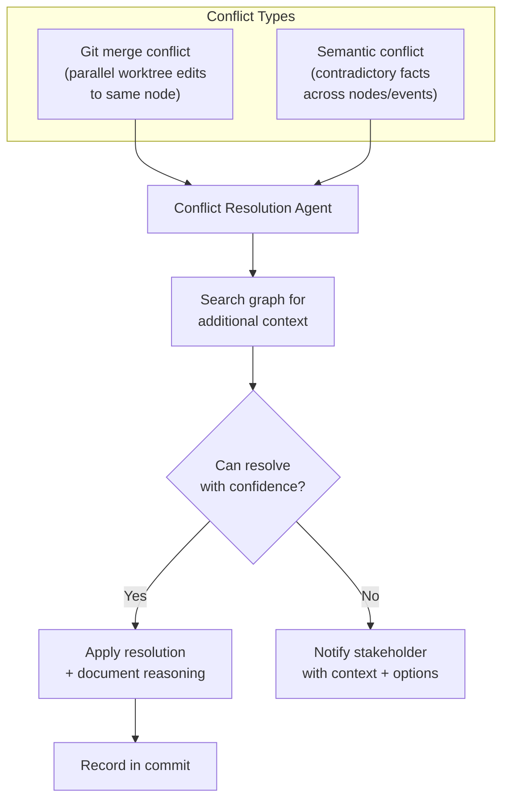
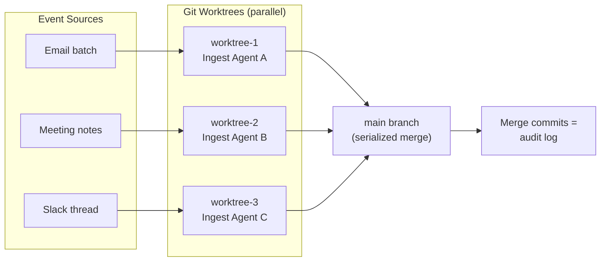

# AI Chief of Staff — Technical Overview

> Organizational intelligence through an agentic, git-versioned knowledge graph

**Stack:** Python 3.12 · FastAPI · OpenAI Agents SDK · ChromaDB · NetworkX · D3.js · React · TypeScript

---

## Core Idea

The system has two layers: **raw events** and **distilled knowledge**. Events (emails, meetings, decisions, messages) arrive as structured data. AI agents process each event, extract lasting knowledge, and weave it into an interconnected graph — a living, versioned source of truth.

The knowledge graph is **flat markdown with wikilinks** (Zettelkasten-style). Entity types emerge organically from the data — not hardcoded. The graph is **git-backed**: every agent call that updates the graph results in a commit, every parallel ingestion runs in its own worktree, and commit messages form a transparent audit trail.

```
┌─────────────────────────────────────────────────────────┐
│                    EVENT SOURCES                         │
│   Email  ·  Slack  ·  Meetings  ·  Docs  ·  Discord     │
└────────────────────────┬────────────────────────────────┘
                         ▼
┌─────────────────────────────────────────────────────────┐
│                   AGENT LAYER                            │
│                                                         │
│  ┌──────────┐  ┌──────────┐  ┌──────────┐  ┌─────────┐ │
│  │ Ingest   │  │ Query    │  │ Optimize │  │ Conflict│ │
│  │ Agent    │  │ Agent    │  │ Agent    │  │ Resolver│ │
│  └──────────┘  └──────────┘  └──────────┘  └─────────┘ │
│       │              │              │             │      │
│       ▼              ▼              ▼             ▼      │
│  ┌──────────────────────────────────────────────────┐   │
│  │              TOOL LAYER                           │   │
│  │  similarity_search · read_node · list_links       │   │
│  │  search_nodes · create_node · update_node         │   │
│  │  get_recent_changes                               │   │
│  └──────────────────────────────────────────────────┘   │
└────────────────────────┬────────────────────────────────┘
                         ▼
┌─────────────────────────────────────────────────────────┐
│                 STORAGE LAYER                            │
│                                                         │
│  graph/nodes/*.md     ChromaDB          .git/           │
│  (source of truth)    (embeddings)      (version hist)  │
│  Markdown + wikilinks  Cosine search    Worktrees +     │
│  Human-readable        text-embed-3     merge commits   │
└─────────────────────────────────────────────────────────┘
```

---

## Storage: The Knowledge Graph

Nodes are **plain markdown files** in `graph/nodes/`. No prescribed schema — the agent writes whatever structure fits the content.

```markdown
# Core Noncore Proposal

Enron's proposal to split cost allocation between core
and noncore gas customers in California.

Key stakeholders: [[jeff-dasovich]], [[richard-shapiro]]
Contrasted with: [[assembly-democrats-cost-shift-plan]]
Source: [[event-2001-06-01-a8f3c2]]
```

Event nodes store raw source data verbatim, linked to the knowledge they produce:

```markdown
---
type: event
timestamp: 2001-06-01
source: email
---

# Event: event-2001-06-01-a8f3c2

​```
From: Jeff Dasovich <jeff.dasovich@enron.com>
Subject: California Update - Core/Noncore Proposal
...
​```
```

### Why Git?

- **Version history** — `git log` = timeline of organizational knowledge evolution
- **Parallel ingestion** — each agent gets a worktree, merges back to main
- **Audit trail** — merge commits document what changed and why
- **Conflict detection** — git surfaces when parallel agents modify the same node
- **Reprocessing** — re-ingest from event nodes if agents improve

### Why Markdown + Flat Files?

- **File over app** — plain text files are the most durable, portable, composable format. No vendor lock-in, no proprietary databases. The knowledge graph is just a directory of `.md` files.
- **The natural medium for AI agents** — LLMs are trained on markdown. They're RL-tuned to read, write, and reason about it. Standard tools (`grep`, `cat`, `diff`) work out of the box. Git version control comes for free.
- **Zettelkasten structure** — small, atomic notes connected by wikilinks. Emergent organization instead of imposed hierarchy. The topology of the graph *is* the structure.
- **Graph analytics** — wikilinks → directed graph → PageRank, community detection, centrality

---

## Agents

### Ingestion Agent

The core agent. Processes events into lasting knowledge.



**Agent tools:** `similarity_search` · `read_node` · `list_links` · `search_nodes` · `get_recent_changes` · `create_node` · `update_node`

**Output:** Structured `IngestionResult` (Pydantic model) — the agent must produce this shape to complete.

**Tracing:** Every tool call is captured via `RunHooks` — action type, arguments, referenced nodes, timing. The frontend animates these traces as the graph updates in real-time.

### Query Agent

Read-only. Answers questions by searching and traversing the graph.



**Perspective-aware:** The agent adapts based on who's asking. A CEO gets a strategic overview. An engineer gets technical detail. A new hire gets onboarding context. The question text itself conveys the perspective — no separate role parameter needed.

### Optimization Agent

Runs periodically in its own worktree. Improves graph quality over time.



### Conflict Resolution Agent

Handles both **git merge conflicts** (same file edited by parallel agents) and **semantic conflicts** (contradictory information across nodes).



---

## Parallel Ingestion

Multiple events process concurrently. Each agent gets its own git worktree — full isolation. Merges are serialized via async lock to maintain consistency.



---

## Graph Analytics

The graph isn't just storage — it's a **queryable network**. Built on NetworkX:

| Metric | What it reveals | How we use it |
|--------|----------------|---------------|
| **PageRank** | Node importance | Node size in visualization |
| **Louvain communities** | Topic clusters | Node coloring |
| **Betweenness centrality** | Information brokers | Identifies key connectors |

The analytics cache invalidates on graph mutations and recomputes lazily.

---

## Ingestors

Multiple source adapters convert raw data into the shared `IngestEvent` format:

| Ingestor | Source |
|----------|--------|
| **Enron** | Enron email corpus (144k emails) |
| **Email** | Generic IMAP/SMTP email |
| **Discord** | Discord channels/threads |
| **File** | Document upload (PDF, text, etc.) |

All ingestors produce the same `IngestEvent` Pydantic model → POST `/ingest` → same agent pipeline.

---

## Frontend

Interactive knowledge graph visualization built with React + D3.js.

### Graph View
- **D3 force-directed layout** with community-colored nodes
- Node size = PageRank (importance)
- Glow effects on knowledge nodes, dimmed event nodes
- Click to explore, drag to rearrange, zoom/pan
- Real-time node highlighting during queries

### Sidebar Panels
- **Explore** — Node detail with markdown rendering, collapsible wikilinks
- **Ask** — Natural language queries with node reference highlighting
- **Ingest** — Event submission with live agent trace animation

### Timeline
- **Slider** scrubs through git history — watch the graph build commit-by-commit
- **Autoplay** steps through the timeline automatically
- **Expandable commit messages** show the agent's reasoning for each ingestion

### Agent Trace Animation
When ingesting, the frontend visualizes each agent tool call in sequence:
`search → read → read → create → update → create`

Each step highlights the affected nodes on the graph, showing how the agent traverses and builds knowledge in real-time.

---

## API

| Endpoint | Method | Description |
|----------|--------|-------------|
| `/ingest` | POST | Event → worktree → agent → merge → result + trace |
| `/query` | POST | Question → agent traversal → answer with citations |
| `/graph` | GET | Full graph export (nodes + edges + PageRank + communities) |
| `/graph/commits` | GET | Git log with files_changed per commit (timeline) |
| `/nodes/{name}` | GET | Single node content + outlinks + backlinks |

---

## Architecture Vision

```
┌────────────────────────────────────────────────────────────────┐
│                    ORGANIZATIONAL INTELLIGENCE                  │
│                                                                │
│  "Who needs to know this?"    "What changed today?"            │
│  "Where is knowledge blocked?" "What contradicts what?"        │
│                                                                │
├────────────────────────────────────────────────────────────────┤
│                                                                │
│  ┌──────────┐  ┌──────────┐  ┌──────────┐  ┌──────────────┐  │
│  │ Ingest   │  │ Query    │  │ Optimize │  │ Stakeholder  │  │
│  │ Agents   │  │ Agent    │  │ Agent    │  │ Notification │  │
│  │ (N||)    │  │          │  │          │  │ Agent        │  │
│  └──────────┘  └──────────┘  └──────────┘  └──────────────┘  │
│       │              │              │              │           │
│       ▼              ▼              ▼              ▼           │
│  ┌────────────────────────────────────────────────────────┐   │
│  │              KNOWLEDGE GRAPH                            │   │
│  │    Markdown + Wikilinks + Embeddings + Git              │   │
│  │    PageRank · Communities · Centrality                   │   │
│  └────────────────────────────────────────────────────────┘   │
│       │                                                       │
│       ▼                                                       │
│  ┌────────────────────────────────────────────────────────┐   │
│  │              IDENTITY & ROUTING                         │   │
│  │    Cross-channel identity resolution                    │   │
│  │    Stakeholder graph → targeted information routing      │   │
│  │    Abstraction pyramid (CEO ↔ IC depth control)         │   │
│  └────────────────────────────────────────────────────────┘   │
│                                                                │
└────────────────────────────────────────────────────────────────┘
```

### Extensions

**Stakeholder Notifications** — When new knowledge arrives, the system determines who needs to know based on the stakeholder graph. Not broadcast — targeted routing based on role, involvement, and knowledge dependencies.

**Identity Resolution** — The same person appears across email, Slack, meetings, code reviews. The system builds a unified identity graph, linking `jeff.dasovich@enron.com` ↔ `Jeff Dasovich` ↔ `@jdasovich` into a single entity.

**Abstraction Pyramid** — The same question answered at different depths depending on who's asking. CEO gets the 3-bullet strategic view. The team lead gets operational detail. The IC gets full technical context. Controlled by traversal depth and synthesis framing.

**Reprocessing Pipeline** — As agents improve, re-ingest from stored event nodes to refine the knowledge graph without re-fetching source data.

---

## Project Structure

```
├── core/src/core/          # Backend
│   ├── agents/
│   │   ├── ingest.py       # Ingestion agent + prompt
│   │   └── query.py        # Query agent + perspective logic
│   ├── server.py           # FastAPI app + orchestration
│   ├── tools.py            # Agent tool definitions
│   ├── graph.py            # Markdown read/write + wikilink parsing
│   ├── graph_index.py      # NetworkX graph + PageRank + communities
│   ├── embeddings.py       # ChromaDB vector index
│   ├── git_ops.py          # Worktrees, commits, merges
│   ├── tracing.py          # Agent step capture via RunHooks
│   └── context.py          # GraphContext (shared state)
│
├── frontend/src/           # React + TypeScript + D3.js
│   ├── App.tsx             # Layout + state management
│   └── components/
│       ├── GraphView.tsx   # D3 force graph + glow effects
│       ├── NodePanel.tsx   # Node detail + markdown rendering
│       ├── QueryPanel.tsx  # Ask the knowledge graph
│       ├── IngestPanel.tsx # Event submission + trace viz
│       ├── TimelineSlider.tsx  # Git history scrubber + autoplay
│       └── TraceAnimation.tsx  # Agent step animation
│
├── ingestors/              # Source adapters
│   ├── enron/              # Enron email corpus
│   ├── email/              # Generic IMAP email
│   ├── discord/            # Discord channels
│   └── file/               # Document upload
│
├── shared/                 # Shared models (IngestEvent)
├── graph/                  # Knowledge graph (git repo)
│   ├── nodes/              # Markdown files
│   └── _index/             # ChromaDB embeddings
│
└── docs/                   # Architecture documentation
```
